<h1 align="center">Entity Resolution with Company Data Enrichment and Databricks GraphRAG</h1>

<p align="center">
  
  
  
</p>

<p align="center">
  
  
  
  
</p>

<p align="center">
  
  
  
  
</p>

## Table of Contents

- [Project Overview](#project-overview)
- [Overall Flow](#overall-flow)
- [Tech Stack](#tech-stack)
- [Repository Structure](#repository-structure)
- [Local Setup](#local-setup)
- [Crawling Step](#crawling-step)
- [Databricks Setup](#databricks-setup)
  - [Requirements](#1-requirements)
  - [Create Unity Catalog Objects](#2-create-unity-catalog-objects)
  - [Upload the ER-Ready CSV](#3-upload-the-er-ready-csv)
  - [Import the Databricks Notebooks](#4-import-the-databricks-notebooks)
  - [Create a Databricks Job to Run the Notebook Pipeline](#5-create-a-databricks-job-to-run-the-notebook-pipeline)
- [Databricks Notebook Outputs](#databricks-notebook-outputs)
- [Matching Logic](#matching-logic)
- [XAI and SHAP Explanation Layer](#xai-and-shap-explanation-layer)
- [GraphRAG Documents](#graphrag-documents)
- [Create AI Search / Vector Search for AI Playground](#create-ai-search--vector-search-for-ai-playground)
  - [Enable Change Data Feed](#1-enable-change-data-feed)
  - [Create an AI Search Endpoint](#2-create-an-ai-search-endpoint)
  - [Create an AI Search Index](#3-create-an-ai-search-index)
  - [Try the Index in AI Playground](#4-try-the-index-in-ai-playground)
  - [Resync After GraphRAG Document Changes](#5-resync-after-graphrag-document-changes)
- [Notes and Limitations](#notes-and-limitations)
- [References](#references)

## Project Overview

This project implements an end-to-end company entity-resolution system for matching noisy input company records to enriched candidate company records.

The workflow first enriches raw company data using website and social URL crawling, rule-based extraction, geographic validation, and confidence-based merge logic. The enriched output is then exported into an entity-resolution-ready dataset and loaded into Databricks.

Inside Databricks, the project builds a full entity-resolution pipeline: it cleans company records, generates candidate pairs, scores each pair with string similarity, semantic similarity, and location signals, applies deterministic match rules, resolves ambiguous cases with an LLM tie-breaker, and creates final match/no-match/review decisions.

The final layer converts decisions into a knowledge graph, SHAP-backed XAI explanations, and GraphRAG-ready retrieval documents, allowing users to ask natural-language questions about candidate companies, match reasons, unresolved review cases, and explainability evidence through Databricks AI Playground or the project notebook workflow.

## Overall Flow

The full project is run in two environments: the local machine first, then Databricks.

```mermaid
flowchart LR
    subgraph LOCAL["Local root: local enrichment workspace"]
        A["Project root<br/>README.md, config/, src/, dataset/"] --> B["Create venv + install deps<br/>requirements.txt"]
        B --> C["Run local pipeline<br/>company_data_enrichment.pipeline run-all"]
        C --> C1["Read config + raw CSV<br/>company_data_enrichment.yaml<br/>data_sample_AofAI.csv"]
        C1 --> C2["Build URL manifest<br/>website + social URL columns"]
        C2 --> C3["Build crawl queue<br/>deduplicate URLs + prioritize official sites"]
        C3 --> C4["Crawl with Crawl4AI<br/>official websites, social pages,<br/>optional shallow deep crawl"]
        C4 --> C5["Write raw crawl results<br/>crawl_results_raw.parquet"]
        C5 --> C6["Extract + validate fields<br/>HTML/Markdown, JSON-LD, TLD,<br/>country and city signals"]
        C6 --> C7["Merge enrichment evidence<br/>KEEP / ADD / REPLACE rules"]
        C7 --> D["Export ER-ready dataset<br/>dataset/silver/data_er_ready.csv"]
    end

    subgraph DBX["Databricks workspace"]
        E["Create UC schema + volume"] --> F["Upload CSV"]
        F --> G["Import notebooks"]
        G --> H["Create Job"]
        H --> I["Run Job"]
        I --> J["ER + GraphRAG tables"]
        J --> K["AI Search index"]
        K --> L["AI Playground"]
    end

    D --> E
```



Step-by-step:

1. Start on your local machine from the project root directory.

```bash
cd "Entity Resolution"
```

2. Create the Python environment and install dependencies.

```bash
python -m venv .venv
source .venv/bin/activate
pip install -r requirements.txt
export PYTHONPATH="$PWD/src"
```

3. Run the local enrichment workflow.

```bash
python -m company_data_enrichment.pipeline run-all \
  --config config/company_data_enrichment.yaml
```

4. Use the generated ER-ready file:

```text
dataset/silver/data_er_ready.csv
```

5. In Databricks, create the target Unity Catalog schema and volume.

```sql
CREATE SCHEMA IF NOT EXISTS workspace.entity_resolution_project;

CREATE VOLUME IF NOT EXISTS workspace.entity_resolution_project.er_project_files;
```

6. Upload the local ER-ready file to this Databricks volume path:

```text
/Volumes/workspace/entity_resolution_project/er_project_files/data_er_ready.csv
```

7. Import the notebooks from:

```text
src/Databricks notebook/notebooks/
src/Databricks notebook/setup/
```

8. Create one Databricks Job with the notebooks as sequential tasks, using the dependency order:

```text
01_load_er_ready
  -> 02_clean_company_er
  -> 03_generate_candidates
  -> 04_score_candidates
  -> 05_decision_layer
  -> 06_llm_tiebreaker
  -> 07_all_candidates_decisions
  -> 08_finalize_decisions
  -> 09_knowledge_graph
  -> 10_xai_explanation
  -> 11_graphrag
  -> enable_change_data_feed
```

9. Run the Databricks Job. This creates the final decision tables, graph tables, SHAP-backed XAI explanation table, GraphRAG document table, and enables Change Data Feed for AI Search indexing.

10. Create the Databricks AI Search / Vector Search endpoint and index over:

```text
workspace.entity_resolution_project.company_er_graphrag_documents
```

11. Open Databricks AI Playground, add the AI Search index as a tool, and test natural-language questions about matched companies, candidate lists, review cases, and explanation evidence.

## Repository Structure

```text
.
├── .gitignore
├── README.md
├── requirements.txt                               # Local Python dependencies
├── config/
│   └── company_data_enrichment.yaml               # Enrichment and validation configuration
├── dataset/
│   ├── data_sample_AofAI.csv                      # Raw sample input
│   └── silver/                                    # Tracked enrichment outputs used by Databricks
│       ├── data_enriched.csv
│       └── data_er_ready.csv
├── src/
│   ├── company_data_enrichment/                   # Local Python enrichment, extraction, validation, and export logic
│   │   ├── crawler.py
│   │   ├── extractors.py
│   │   ├── geo_signals.py
│   │   ├── pandas_io.py
│   │   ├── pipeline.py
│   │   ├── quality_report.py
│   │   ├── rules.py
│   │   └── url_manifest.py
│   └── Databricks notebook/
│       ├── notebooks/                             # Main Databricks entity-resolution and GraphRAG notebooks 
│       │   ├── 01_load_er_ready.ipynb
│       │   ├── 02_clean_company_er.ipynb
│       │   ├── 03_generate_candidates.ipynb
│       │   ├── 04_score_candidates.ipynb
│       │   ├── 05_decision_layer.ipynb
│       │   ├── 06_llm_tiebreaker.ipynb
│       │   ├── 07_all_candidates_decisions.ipynb
│       │   ├── 08_finalize_decisions.ipynb
│       │   ├── 09_knowledge_graph.ipynb
│       │   ├── 10_xai_explanation.ipynb
│       │   └── 11_graphrag.ipynb
│       └── setup/                                 # Databricks setup notebook for Change Data Feed
│           └── enable_change_data_feed.ipynb
└── test/                                          # Unit tests
    ├── test_crawler.py
    ├── test_extractors.py
    ├── test_geo_signals.py
    ├── test_pandas_io.py
    ├── test_pipeline.py
    ├── test_rules.py
    └── test_url_manifest.py
```

## Local Setup

Create and activate a Python environment:

```bash
python -m venv .venv
source .venv/bin/activate
pip install -r requirements.txt
export PYTHONPATH="$PWD/src"
```

Run tests:

```bash
pytest
```

## Crawling Step

The crawling step is part of the local enrichment workflow. The local pipeline is configured in:

```text
config/company_data_enrichment.yaml
```

Default input:

```text
dataset/data_sample_AofAI.csv
```

Default output directory:

```text
dataset/silver
```

The crawling step is the web data collection stage of the local enrichment workflow. It uses Crawl4AI to fetch raw website and social-page content before the extractor turns that content into structured company fields.

The crawl flow is:

```text
raw CSV URL columns
  -> URL manifest
  -> deduplicated crawl queue
  -> Crawl4AI browser crawl
  -> raw crawl results
  -> extraction and merge steps
```

Detailed Python and file flow:

```text
python -m company_data_enrichment.pipeline run-all --config config/company_data_enrichment.yaml
  -> src/company_data_enrichment/pipeline.py::main()
  -> src/company_data_enrichment/pipeline.py::run_all()

run_all()
  -> run_build_manifest()
     -> src/company_data_enrichment/pandas_io.py::read_input_csv()
     -> src/company_data_enrichment/url_manifest.py::build_url_manifest()
     -> src/company_data_enrichment/url_manifest.py::build_crawl_queue()
     -> src/company_data_enrichment/pipeline.py::build_geo_prefill()
     -> writes dataset/silver/url_manifest.parquet
     -> writes dataset/silver/crawl_queue.parquet
     -> writes dataset/silver/geo_prefill.parquet

  -> run_crawl()
     -> reads dataset/silver/crawl_queue.parquet
     -> src/company_data_enrichment/crawler.py::crawl_records()
     -> src/company_data_enrichment/crawler.py::crawl_records_async()
     -> Crawl4AI AsyncWebCrawler
     -> writes dataset/silver/crawl_results_raw.parquet

  -> run_extract()
     -> reads dataset/silver/crawl_results_raw.parquet
     -> reads dataset/silver/url_manifest.parquet
     -> src/company_data_enrichment/extractors.py::extract_rows()
     -> src/company_data_enrichment/extractors.py::extract_from_html()
     -> src/company_data_enrichment/pipeline.py::build_company_validation_results()
     -> src/company_data_enrichment/geo_signals.py country/city signal helpers
     -> writes dataset/silver/crawl_extracted_fields.parquet
     -> writes dataset/silver/company_validation_results.parquet
     -> writes dataset/silver/company_validation_results.csv

  -> run_merge()
     -> src/company_data_enrichment/pipeline.py::build_best_evidence()
     -> src/company_data_enrichment/pipeline.py::build_evidence_frame()
     -> src/company_data_enrichment/rules.py::decide_action()
     -> src/company_data_enrichment/rules.py::choose_final_value()
     -> src/company_data_enrichment/quality_report.py::build_quality_report()
     -> writes dataset/silver/data_enriched.parquet
     -> writes dataset/silver/data_enriched.csv

  -> run_export_er_ready()
     -> reads dataset/silver/data_enriched.parquet
     -> src/company_data_enrichment/pipeline.py::build_er_ready_frame()
     -> writes dataset/silver/data_er_ready.parquet
     -> writes dataset/silver/data_er_ready.csv
```

The detailed flow maps to the local pipeline stages as follows:

- `pipeline.py` is the entrypoint and stage orchestrator for every local enrichment command.
- `pandas_io.py` handles CSV and Parquet reads/writes used across the stages.
- `url_manifest.py` builds the URL manifest and deduplicated crawl queue.
- `crawler.py` runs Crawl4AI and returns raw page results.
- `extractors.py` extracts structured company evidence from crawled HTML and markdown.
- `geo_signals.py` supports country and city validation.
- `rules.py` decides whether to keep, add, or replace original values with extracted values.
- `quality_report.py` summarizes enrichment quality after merge.

The URL manifest is built from the URL columns configured in `config/company_data_enrichment.yaml`:

```text
website_url
linkedin_url
facebook_url
instagram_url
twitter_url
youtube_url
```

The crawler normalizes URLs, removes duplicates, stores the canonical URL and domain, and prioritizes official company websites before social URLs. Official website URLs can also use a shallow deep-crawl strategy to visit useful subpages such as company, contact, or about pages.

The crawler is configured by the `crawl` section in `config/company_data_enrichment.yaml`, including:

```text
max_concurrency
timeout_ms
retry_count
deep_crawl_enabled
deep_crawl_max_depth
deep_crawl_max_pages
reuse_previous_results
cache_base_dir
```

The crawler also filters out low-value or risky pages such as login, signup, account, cart, checkout, privacy, cookie, terms pages, and static files such as images, PDFs, archives, and office documents.

Run only the crawl stage:

```bash
python -m company_data_enrichment.pipeline crawl \
  --config config/company_data_enrichment.yaml
```

For a small crawl test:

```bash
python -m company_data_enrichment.pipeline crawl \
  --config config/company_data_enrichment.yaml \
  --limit 10
```

You can also run each stage separately:

```bash
python -m company_data_enrichment.pipeline build-manifest --config config/company_data_enrichment.yaml
python -m company_data_enrichment.pipeline crawl --config config/company_data_enrichment.yaml
python -m company_data_enrichment.pipeline extract --config config/company_data_enrichment.yaml
python -m company_data_enrichment.pipeline merge --config config/company_data_enrichment.yaml
python -m company_data_enrichment.pipeline export-er-ready --config config/company_data_enrichment.yaml
```

The crawling step writes raw crawl outputs under `dataset/silver`, including the crawl queue and raw crawl results. These outputs are then used by the `extract` step to identify enriched company attributes such as location, email, phone, description, and other metadata.

Important generated files include:

```text
dataset/silver/data_enriched.csv
dataset/silver/data_er_ready.csv
dataset/silver/company_validation_results.csv
```

These files contain:

- `data_enriched.csv`: The enriched company dataset after crawling, extraction, validation, and rule-based merge logic. It keeps the improved company attributes and enrichment evidence used before the entity-resolution step.
- `data_er_ready.csv`: The final local export prepared for Databricks entity resolution. This is the main file uploaded to the Databricks volume and loaded by `01_load_er_ready.ipynb`.
- `company_validation_results.csv`: The country and city validation audit output. It records signals such as TLD, language, JSON-LD, web text, social evidence, voted country, confidence, verdict, recommended action, and validation reason. This file is generated by the pipeline but is not committed to Git because it can be large.

The file used by Databricks is:

```text
dataset/silver/data_er_ready.csv
```

## Databricks Setup

> **Note:** You need a Databricks account to run this part of the project. A free or trial account is enough for exploration, as long as the workspace supports the required features such as notebooks, Unity Catalog, `ai_query`, and AI Search / Vector Search.

The Databricks notebooks currently use this Unity Catalog namespace:

```text
workspace.entity_resolution_project
```

and this volume:

```text
workspace.entity_resolution_project.er_project_files
```

If you use another catalog, schema, or volume, update the first notebook and the table names in the remaining notebooks.

### 1. Requirements

You need:

- A Databricks workspace with Unity Catalog enabled.
- Compute that can access Unity Catalog.
- Access to Databricks model serving or Foundation Model APIs for `ai_query`.
- Access to the embedding and LLM endpoints used in the notebooks:
  - `databricks-gte-large-en`
  - `databricks-gpt-oss-120b`
- Permissions to create tables in the target schema.
- Permissions to create and write to a Unity Catalog volume.
- For AI Search / Vector Search: serverless compute enabled and Change Data Feed enabled on the source Delta table.

`ai_query` is used in the scoring, LLM tie-breaker, and GraphRAG notebooks. Databricks Runtime `15.4 LTS` or above is recommended for current `ai_query` workflows.

Notebook `10_xai_explanation.ipynb` installs SHAP as a notebook-scoped Databricks dependency:

```python
%pip install --no-deps "shap==0.46.0"
%restart_python
```

`shap` is not required for the local enrichment pipeline in `requirements.txt`; it is used only inside Databricks for post-hoc explanation of the deterministic composite score.

### 2. Create Unity Catalog Objects

Run this in a Databricks SQL editor or notebook SQL cell:

```sql
CREATE SCHEMA IF NOT EXISTS workspace.entity_resolution_project;

CREATE VOLUME IF NOT EXISTS workspace.entity_resolution_project.er_project_files;
```

If the `workspace` catalog is not available in your environment, use another catalog and update the notebooks accordingly.

### 3. Upload the ER-Ready CSV

Upload:

```text
dataset/silver/data_er_ready.csv
```

to:

```text
/Volumes/workspace/entity_resolution_project/er_project_files/data_er_ready.csv
```

You can upload through the Databricks UI:

1. Go to **New > Add or upload data**.
2. Select **Upload files to a volume**.
3. Choose or paste the destination volume path.
4. Upload `data_er_ready.csv`.

### 4. Import the Databricks Notebooks

Import the notebooks from:

```text
src/Databricks notebook/notebooks/
src/Databricks notebook/setup/
```

Databricks supports importing `.ipynb` notebooks.

Recommended run order:

```text
01_load_er_ready.ipynb
02_clean_company_er.ipynb
03_generate_candidates.ipynb
04_score_candidates.ipynb
05_decision_layer.ipynb
06_llm_tiebreaker.ipynb
07_all_candidates_decisions.ipynb
08_finalize_decisions.ipynb
09_knowledge_graph.ipynb
10_xai_explanation.ipynb
11_graphrag.ipynb
setup/enable_change_data_feed.ipynb
```

### 5. Create a Databricks Job to Run the Notebook Pipeline

After importing the notebooks, you can create one Databricks Job so the full notebook pipeline runs in a single job run.

Because each notebook writes Delta tables that are used by the next notebook, configure the tasks sequentially with dependencies instead of running them all in parallel.

In Databricks:

1. Go to **Jobs & Pipelines**.
2. Click **Create job**.
3. Name the job, for example:

```text
entity-resolution-notebook-pipeline
```

4. Add the first task:
   - **Task type**: `Notebook`
   - **Task name**: `01_load_er_ready`
   - **Notebook path**: the imported `01_load_er_ready.ipynb`
   - **Compute**: choose an existing cluster, serverless compute, or a new job cluster that can access Unity Catalog and `ai_query`

5. Add the remaining notebooks as separate `Notebook` tasks. For each task, set **Depends on** to the previous notebook task so the job becomes a DAG that runs in the same order as the manual run order.

Recommended task dependency chain:

```text
01_load_er_ready
  -> 02_clean_company_er
  -> 03_generate_candidates
  -> 04_score_candidates
  -> 05_decision_layer
  -> 06_llm_tiebreaker
  -> 07_all_candidates_decisions
  -> 08_finalize_decisions
  -> 09_knowledge_graph
  -> 10_xai_explanation
  -> 11_graphrag
  -> enable_change_data_feed
```

6. Use the same compute configuration for all notebook tasks unless your workspace requires different compute for model-serving or AI Search preparation.
7. Keep the default setting that allows only one concurrent run of the job. This prevents two pipeline runs from overwriting the same Delta tables at the same time.
8. Click **Run now** to execute the full notebook pipeline once.

After the job finishes successfully, the final GraphRAG document table should exist and Change Data Feed should be enabled:

```text
workspace.entity_resolution_project.company_er_graphrag_documents
```

At that point, continue with the AI Search / Vector Search index setup.

## Databricks Notebook Outputs

The notebooks create these main Delta tables:

```text
workspace.entity_resolution_project.company_er_ready
workspace.entity_resolution_project.company_er_clean
workspace.entity_resolution_project.company_er_candidates
workspace.entity_resolution_project.company_er_scores
workspace.entity_resolution_project.company_er_decisions
workspace.entity_resolution_project.company_er_llm_input
workspace.entity_resolution_project.company_er_llm_tiebreaker
workspace.entity_resolution_project.company_er_all_candidate_decisions
workspace.entity_resolution_project.company_er_final_candidates
workspace.entity_resolution_project.company_er_final_decisions
workspace.entity_resolution_project.company_er_graph_nodes
workspace.entity_resolution_project.company_er_graph_edges
workspace.entity_resolution_project.company_er_xai_explanations
workspace.entity_resolution_project.company_er_graphrag_documents
workspace.entity_resolution_project.company_er_graphrag_retrieval_results
workspace.entity_resolution_project.company_er_graphrag_answers
```

## Matching Logic

Candidate scoring uses these weighted signals:

```text
Name similarity:      0.60
Semantic similarity:  0.05
Country match:        0.20
City match:           0.15
```

Semantic similarity is calculated with cosine similarity between the input-company embedding and the candidate-company embedding:

```text
semantic_dot =
  sum(left_embedding_i * right_embedding_i)

left_norm =
  sqrt(sum(left_embedding_i^2))

right_norm =
  sqrt(sum(right_embedding_i^2))

semantic_similarity_raw =
  semantic_dot / (left_norm * right_norm)

semantic_similarity =
  clamp(semantic_similarity_raw, 0.0, 1.0)
```

The final composite score is then calculated as:

```text
composite_score =
  name_similarity * 0.60
  + semantic_similarity * 0.05
  + country_match * 0.20
  + city_match * 0.15
```

Deterministic decision rules:

```text
MATCH:
  - Top candidate score >= 0.80
  - OR top candidate score >= 0.70 and top1-top2 score gap >= 0.05

AMBIGUOUS:
  - Top candidate score >= 0.55
  - But it does not satisfy the MATCH rules

NO_MATCH:
  - Top candidate score < 0.55
  - Or the candidate is not the rank-1 candidate for the input company
```

Ambiguous rank-1 candidates are sent to the LLM tie-breaker. An LLM result is accepted only when:

```text
llm_decision in (MATCH, NO_MATCH)
llm_confidence >= 0.70
```

Otherwise, the record remains for review.

## XAI and SHAP Explanation Layer

Notebook `10_xai_explanation.ipynb` adds a post-hoc XAI layer after final decisions have already been produced. SHAP is used only to explain the deterministic composite score; it does not change candidate ranking, thresholds, LLM tie-breaker outcomes, or final `MATCH`, `NO_MATCH`, and `REVIEW` decisions.

The notebook decomposes the score into weighted parts and then uses the `shap` library to explain the same score function:

```text
composite_score =
  name_similarity * 0.60
  + semantic_similarity * 0.05
  + country_match * 0.20
  + city_match * 0.15
```

The resulting XAI table is:

```text
workspace.entity_resolution_project.company_er_xai_explanations
```

Key SHAP columns include:

```text
shap_base_value            # average baseline score before feature contributions
name_similarity_shap       # contribution from company-name similarity
semantic_similarity_shap   # contribution from embedding-based semantic similarity
country_match_shap         # contribution from country match signal
city_match_shap            # contribution from city match signal
shap_predicted_score       # reconstructed score from baseline + SHAP contributions
shap_score_abs_error       # absolute gap between reconstructed and original composite score
```

`shap_predicted_score` reconstructs the deterministic `composite_score` from `shap_base_value` and the feature-level SHAP contributions. `shap_score_abs_error` validates the reconstruction error.

Report-ready SHAP visualizations from the notebook show:

- **Global SHAP feature importance**: `city_match` has the largest mean absolute SHAP value (`0.074`), followed by `name_similarity` (`0.059`), `country_match` (`0.038`), and `semantic_similarity` (`0.004`). This suggests location and name signals drive most of the deterministic score variation.
- **Row-level SHAP explanation for one `MATCH` decision**: for `HUAWEI TECHNOLOGIES NORWAY AS` vs `Huawei Technologies Norway AS`, all SHAP contributions are positive: `name_similarity` (`+0.094`), `city_match` (`+0.087`), `country_match` (`+0.020`), and `semantic_similarity` (`+0.010`). The baseline score is `0.789`, and the SHAP-reconstructed score, composite score, and final confidence are all `1.000`. This confirms that the final high-confidence MATCH is mainly supported by name similarity and city match, with smaller positive support from country match and semantic similarity.

## GraphRAG Documents

Notebook `11_graphrag.ipynb` creates a retrieval-ready table:

```text
workspace.entity_resolution_project.company_er_graphrag_documents
```

This table contains documents for:

- Final graph decisions
- Non-top candidates
- Exact company lookup
- XAI explanations with composite score, SHAP feature contributions, confidence, LLM reason, and final reason
- Structured project summary

The most important columns for retrieval are:

```text
doc_id
doc_type
context_text
```

For `XAI_EXPLANATION` documents, `context_text` includes the final decision, composite score, score gap, entropy, SHAP base value, SHAP predicted score, feature-level SHAP contributions, SHAP additivity error, and decision reasoning. These fields allow GraphRAG and AI Playground to answer questions such as why a candidate matched, why it needed review, or which signals contributed most to the score.

## Create AI Search / Vector Search for AI Playground

Databricks AI Search was formerly known as Databricks Vector Search. This project uses the GraphRAG document table as the source for an AI Search index.

### 1. Enable Change Data Feed

Run:

```text
src/Databricks notebook/setup/enable_change_data_feed.ipynb
```

This enables Change Data Feed on:

```text
workspace.entity_resolution_project.company_er_graphrag_documents
```

Change Data Feed is required for standard AI Search endpoints with Delta Sync indexes.

### 2. Create an AI Search Endpoint

In Databricks:

1. Go to **Compute**.
2. Open the **AI Search** tab.
3. Click **Create endpoint**.
4. Suggested name:

```text
er_graphrag_ai_search_endpoint
```

5. Select **Standard** for a small project or demo setup.
6. Confirm.

### 3. Create an AI Search Index

In Databricks Catalog Explorer:

1. Open the table:

```text
workspace.entity_resolution_project.company_er_graphrag_documents
```

2. Click **Create > Vector search index**.
3. Suggested index name:

```text
workspace.entity_resolution_project.company_er_graphrag_documents_index
```

4. Configure:

```text
Index type: Hybrid
Primary key: doc_id
Embedding source: Compute embeddings
Embedding source column: context_text
Vector Search endpoint: <name of AI Search Endpoint>
Index update mode: Triggered
Columns to index: <blank> or all columns
Advanced settings:
- Embedding model: databricks-gte-large-en
```

5. Create the index.
6. If using Triggered sync, click **Sync now** after the index is created.

### 4. Try the Index in AI Playground

In Databricks:

1. Go to **AI/ML > Playground**.
2. Choose a model with tools enabled (GPT OSS 120B).
3. Click **Tools > Add tool**.
4. Select **Vector Search**.
5. Choose:

```text
workspace.entity_resolution_project.company_er_graphrag_documents_index
```
6. Copy and paste the `ANSWER_RULES` in notebook `11_graphrag.ipynb` to the System Prompt in AI Playground

7. Ask questions such as:

```text
Which companies were candidates for Amazon E Store?
Which company matched to Amazon E Store, and why?
List the records that still need manual review.
Explain why a candidate was not selected as the final match.
Which SHAP features contributed most to a match decision?
Which suppliers were matched from multiple input company names?
```

The AI Playground agent should retrieve relevant context from the AI Search index and cite the retrieved sources.

For exploratory questions, explanations, and specific review-case lookups, AI Playground works well. For exhaustive "list all" outputs, validate with SQL over the source Delta tables.

### 5. Resync After GraphRAG Document Changes

If you change notebook `10_xai_explanation.ipynb` or `11_graphrag.ipynb` in a way that changes the generated XAI explanations or GraphRAG documents, rerun the affected notebooks or the Databricks Job and then sync the AI Search index again.

Changes that do not require an AI Search sync:

- Changing the demo `QUESTION`.
- Changing notebook-only retrieval settings such as `TOP_K`.
- Changing the manual notebook RAG prompt or answer style rules.
- Changing only SHAP visualization formatting in notebook `10_xai_explanation.ipynb`, as long as the saved XAI table and GraphRAG document text do not change.

Those fields affect the manual GraphRAG query inside the notebook, but they do not change the indexed document table used by AI Playground.

If only the rows in `company_er_xai_explanations` or `company_er_graphrag_documents` change, rerun notebook `11_graphrag.ipynb` and sync the existing AI Search index again. If the document table schema or indexed columns change, recreate the AI Search index so the index uses the new structure.

## Notes and Limitations

- Model endpoint names may differ by Databricks workspace or region.
- If `ai_query` returns permission or availability errors, check model serving access and regional feature availability.
- SHAP is installed as a Databricks notebook-scoped dependency in `10_xai_explanation.ipynb`. If the install cell changes package versions, restart Python with `%restart_python` before running the remaining cells.
- SHAP is used as post-hoc explainability for the deterministic composite-score function only. It does not change candidate ranking, thresholds, LLM tie-breaker results, or final match decisions.
- SHAP values explain the score features (`name_similarity`, `semantic_similarity`, `country_match`, `city_match`). For LLM-assisted cases, use SHAP together with `llm_reason` and `final_reason`.
- Notebook `11_graphrag.ipynb` has a hardcoded demo `QUESTION`; update it before rerunning manual GraphRAG inside the notebook.
- The AI Playground flow is separate from the manual GraphRAG notebook. The notebook builds and queries retrieval context directly, while AI Playground uses the AI Search index as a tool.
- For questions that require an exhaustive list of records, the GraphRAG chatbot may not return every item. This is mainly because retrieval returns only the top `K` most relevant documents, and the model can only answer from the retrieved context. In this project, the notebook demo uses `TOP_K = 50`, but increasing `TOP_K` still does not guarantee a complete list if relevant records are not retrieved, are ranked lower, or cannot fit into the model context. This limitation mainly affects "list all..." questions, such as listing all candidates, all suppliers, or all records in a broad category. For exact exhaustive lists, query the Delta tables directly, such as `company_er_all_candidate_decisions`, `company_er_final_decisions`, or `company_er_graphrag_documents`.
- If the GraphRAG document schema changes, recreate the AI Search index because index schemas are fixed at creation time.

## References

- Databricks AI Search endpoints and indexes: https://docs.databricks.com/aws/en/ai-search/create-ai-search
- Databricks AI Playground agents and AI Search tool: https://docs.databricks.com/aws/en/getting-started/gen-ai-llm-agent
- Databricks Lakeflow Jobs configuration: https://docs.databricks.com/aws/en/jobs/configure-job
- Databricks notebook tasks for jobs: https://docs.databricks.com/aws/en/jobs/notebook
- Databricks task dependencies: https://docs.databricks.com/aws/en/jobs/run-if
- Databricks Run now for jobs: https://docs.databricks.com/aws/en/jobs/run-now
- Unity Catalog volumes and file upload: https://docs.databricks.com/aws/en/ingestion/file-upload/
- Import Databricks notebooks: https://docs.databricks.com/aws/en/notebooks/notebook-export-import
- Databricks `ai_query`: https://docs.databricks.com/aws/en/sql/language-manual/functions/ai_query
- SHAP documentation: https://shap.readthedocs.io/
- Crawl4AI GitHub repository: https://github.com/unclecode/crawl4ai
